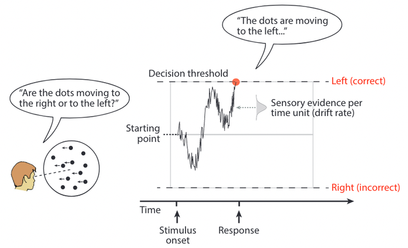
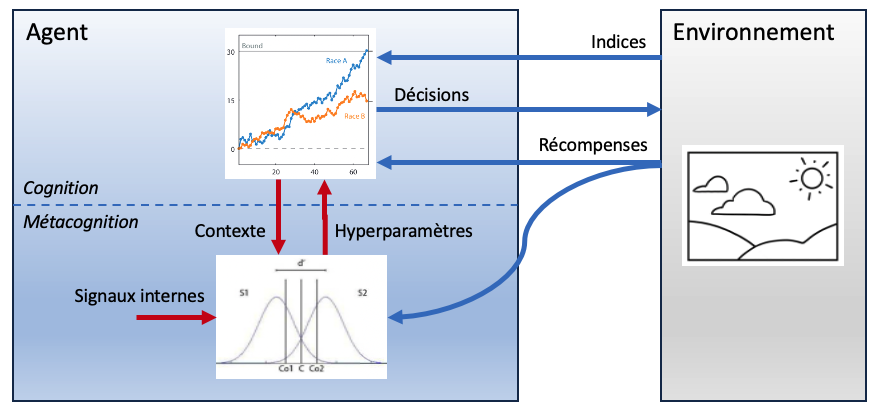

<!-- Apply header and footer to first slide only -->
<!-- _header: "" -->
<!-- _footer: "[Baptiste Pesquet](https://www.bpesquet.fr)" -->

# Confidence as hyperparameter tuning for sequential decision-making

> [Mnémosyne](https://www.inria.fr/fr/mnemosyne) team meeting - October 17th, 2024

---

<!-- Show pagination, starting with second slide -->
<!-- paginate: true -->

## Metacognition

---

## Sequential decision-making

- Speed/Accuracy Tradeoff.
- Canonical model: integration of noisy information until a threshold is reached.
- Many refinements: multi-alternative choice, impact of learning, change of mind, etc.

---

## Confidence for decision-making

- Quantifies the degree of certainty associated to a decision.
- Canonical model: post-decisional computation based on accumulated info.
- Can be used to alter the subsequent decisions.

---

## Proposed architecture: confidence as hyperparameter tuning for sequential decision-making

---

## Current & next steps

- Article for [ESANN 2025](https://www.esann.org/).
- Detailed review of confidence for decision-making (future PhD chapter).
- First experiment on very basic task.

---

## Questions ?
