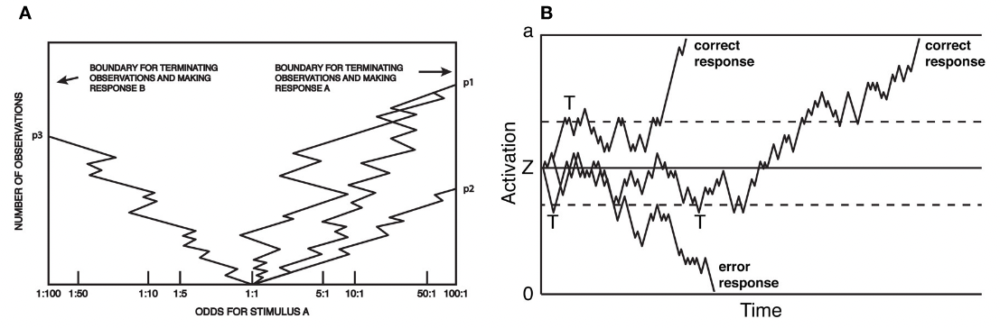
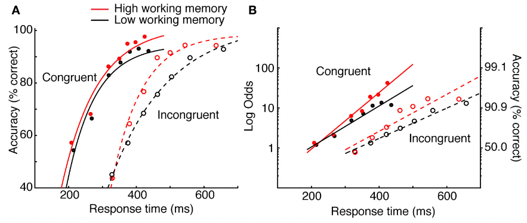

# Heitz, 2014 - The Speed-Accuracy Tradeoff: History, Physiology, Methodology, and Behavior

## Takeaways

- The tendency for decision speed to covary with decision accuracy seems an inescapable property of choice behavior.
- The pervasiveness of the SAT makes this phenomenon interesting by itself.
- SAT is a benchmark for models of the décision process.
- Neuroscience (fMRI, EEG) is helping researchers understand how the brain transform sensory information into a decision.
- Historical milestones:
  - 1800's: first studies on nerve condution (von Helmholtz).
  - 1940's: SPRT, first statistical framework for decision as sequential sampling of information ([Wald](../statistics/Wald1948.md)).
  - 1960's: random walk, formal mathematical model of the decision process (Stone).
  - 1970's: DDM ([Ratcliff](Ratcliff1978.md))
  - Ongoing works... Consensus is that agents make choices based on a sequential analysis of sensory evidence.
- Recent results capture both behavior and neurobiology: neural activity grows over time during the deliberation period and terminates at a fixed threshold at the moment an overt decision is produced.

## Source

> Richard P. Heitz, “The Speed-Accuracy Tradeoff: History, Physiology, Methodology, and Behavior,” Frontiers in Neuroscience 8 (June 11, 2014), <https://doi.org/10.3389/fnins.2014.00150>.

