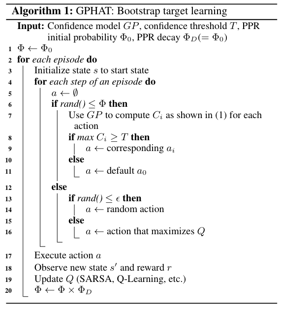

# Wang and Taylor, 2017 - Improving Reinforcement Learning with Confidence-Based Demonstrations

## Takeaways

- A method for speeding reinforcement learning is HAT (Human-Agent Transfer):
  1. A source agent (human or artificial) learns a policy, recorded a a set of demonstrations (state-action pairs).
  1. A decision tree is trained to summarize these pairs as a static set of rules.
  1. The target agent uses the DT to bootstrap its learning, using a decaying $\phi$ parameter to choose between following the classifier or using its own Q-values.
- The CHAT (Confidence-HAT) is introduced as an improvement over HAT. The confidence $T$ is computed from the classifier and used in the target agent's algorithm as à threshold for following the classifier.
- Three different classifiers (a Gaussian Process, a 2-layers MLP and a decision tree) are tested in two RL environments: Mario and Keepaway (from Robocup).
- Results show CHAT outperforms standalone learning and HAT on both environments.

## Source

> Zhaodong Wang and Matthew E. Taylor, “Improving Reinforcement Learning with Confidence-Based Demonstrations,” in Proceedings of the Twenty-Sixth International Joint Conference on Artificial Intelligence, 3027–33, <https://doi.org/10.24963/ijcai.2017/422>.

